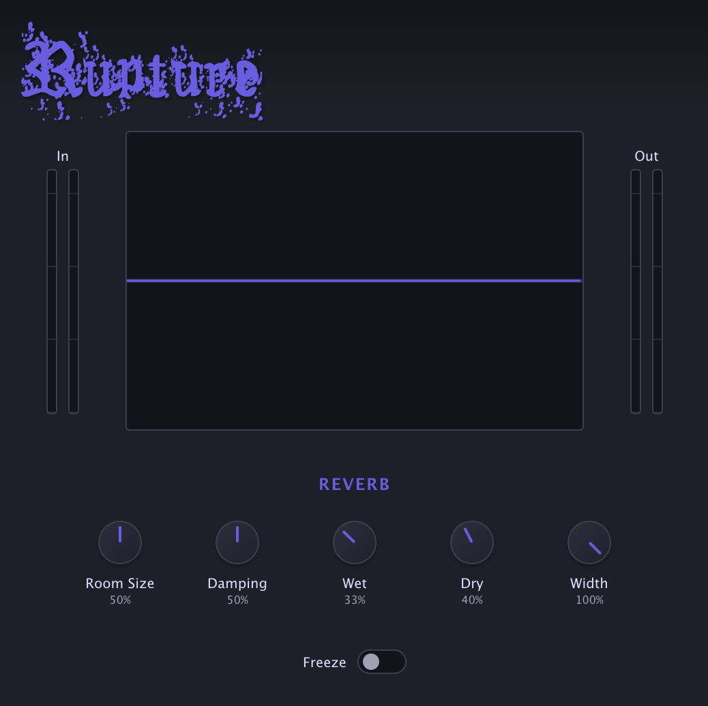

### Plugin Features

- 0ms latency
- Real-time oscilloscope to display output audio
- Preset manager with ability to save and load presets
- Input/Output gain staging

### Repository

- Built in C++ with JUCE 8
- Compilation with CMake into VST3 format
- WebView Component Integration for UI
- SASS for better organization and a templated theming system

## Build & Installation

1. After cloning the repository run

   ```
   git submodule add https://github.com/juce-framework/JUCE.git
   git submodule update --init --recursive
   ```

2. Build the project

   ```
   cmake -B build # first time only
   cmake --build build
   ```

3. Copy the plugin to your VST folder (Optional)

   - The project is auto copying to the default vst folder for me. I'm using a Mac but if you're on Windows it should copy to `C:\Program Files\Common Files\VST3` or Linux `~/.vst3`. If not do it manually.

---


